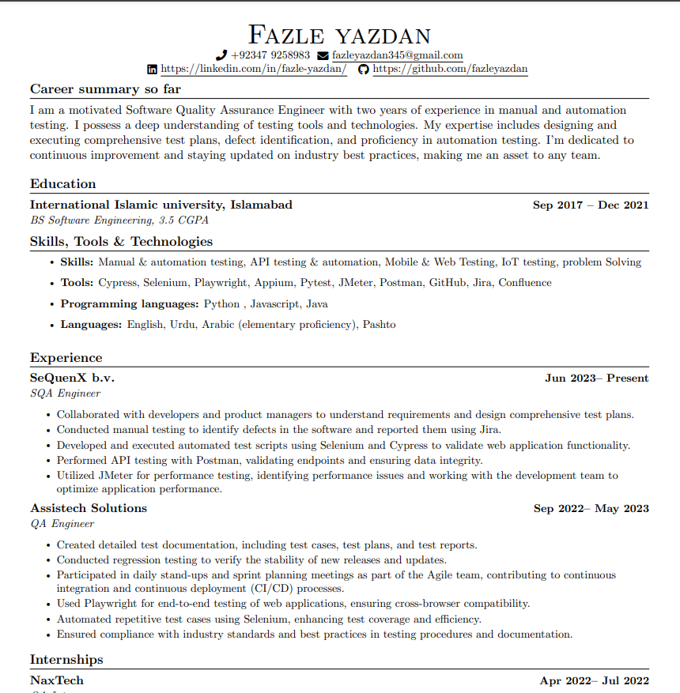
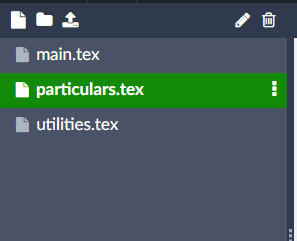
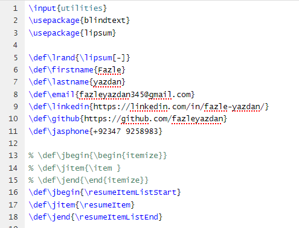

# generate-cv-using-LaTex

#### Resume Template:

#### Step 1: 
* Go to:  overleaf.com

#### Step 2:
* create files with the same name as it is i.e. 'main.tex' , 'utilities.tex' & 'particulars.tex'.

#### Step 3:
* Modify resume : add information of your choice 
* if you wanna tailor according to your needs: open 'particulars.tex" file & make changes.

